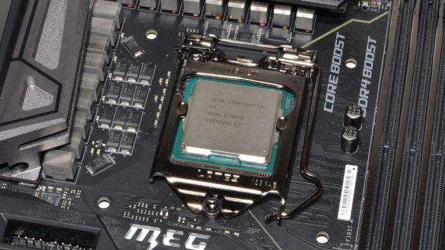
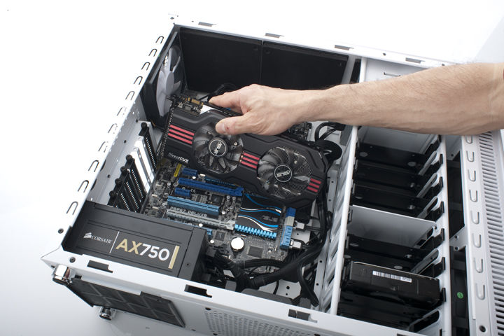
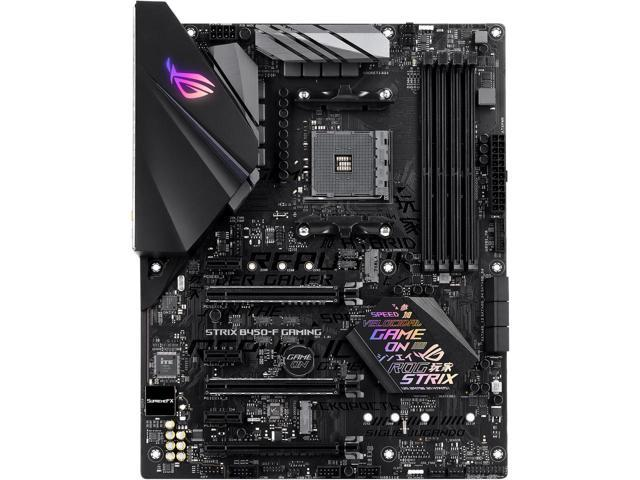
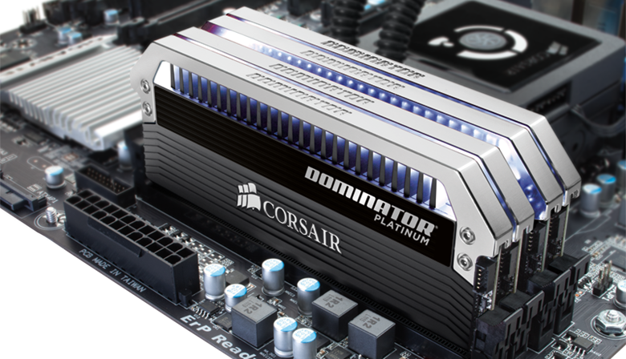
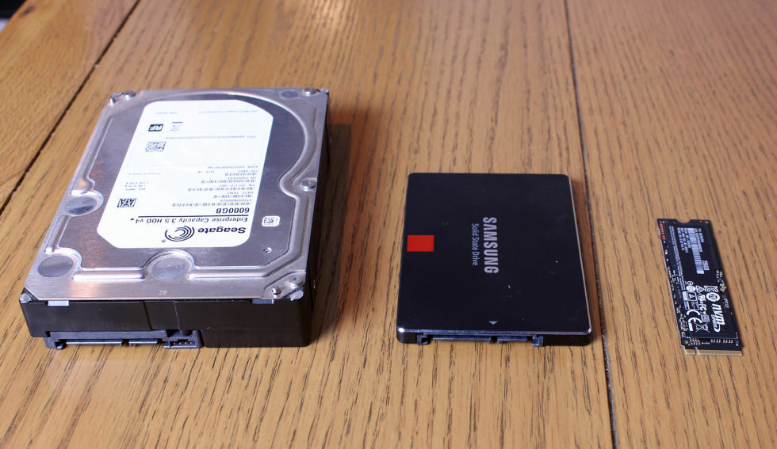
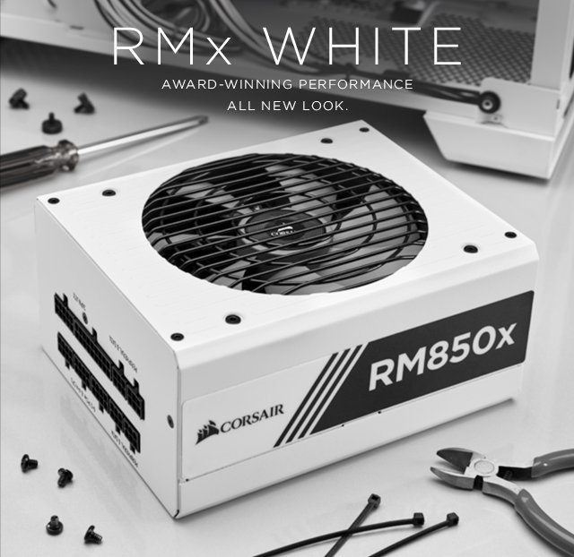
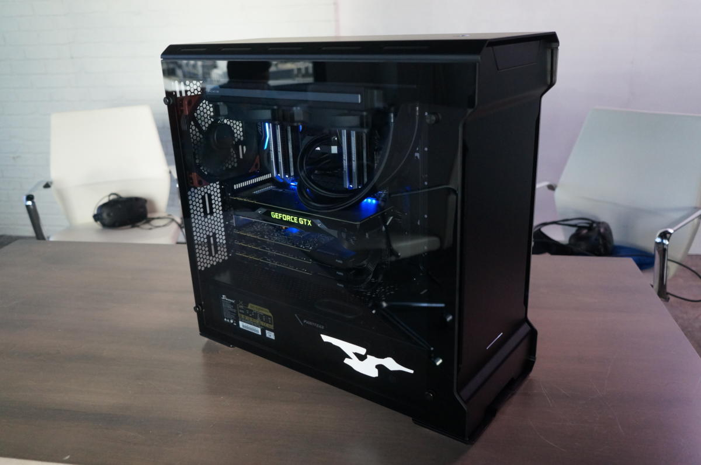

# Gamers Guide to Building a PC
**No nonsense. Easy to understand. From a gamer's perspective.**

This markdown is intended to explain basic computer components to those interested in building a PC. This is not comprehensive - computers are complex and your build may require more hardware. Through reading this, a computer novice will understand where to start.

*- Kevin Frayne*

***

**There are 7 components needed for any "build" and they are as follows:**  

- CPU
- GPU
- Motherboard
- RAM
- Storage
- Power Supply Unit
- Case

### CPU
The CPU is the main chip of a computer that is responsible for telling all other components what to do...it's the brain of the system. The two main CPU manufacturers are Intel and AMD. Below, an Intel processor sits in the CPU slot of the motherboard.

### GPU
The GPU (graphics processing unit) is essential for any gaming build. When I built my PC, this was my most expensive component. The GPU, commonly called the "graphics card" is the chip responsible for rendering all images/video/animation for the computer. Today, a lot of computers have "integrated graphics" which means that the GPU is built into the CPU. Although these integrated chips have gotten much better over the years, they are still not close to the performance a stand-alone graphics card offers. The graphics card plugs into areas on the motherboard called "PCI-E" slots. The two primary manufacturers of GPUs are Nvidia and AMD.

### Motherboard *(MoBo)*
The Motherboard is the component of the computer that everything plugs into. The main function of the MoBo is that it allows all the parts of your PC to receive power and communicate with one another. Many motherboards today have additional features too though like built-in WiFi and Bluetooth so you don't have to buy additional adapters.

### RAM
RAM (random access memory) is the short-term memory of your computer. This memory is where your computer keeps track of all the programs you currently have open at a given time. If you ever try to open something and your computer slows down, its because you don't have enough RAM to process all the things you are doing. The more RAM you have, the more processes your computer can handle at once. For a gaming PC, 8-16GB is enough to run all modern games. RAM plugs into the RAM slots of the MoBo.

### Storage
Storage is where all your files are stored! These days there's a lot of different storage options to choose from. Years ago, the standard storage component of a PC was a mechanical harddrive (HDD) but now Solid State Drives (SSDs) are becoming the norm. HDDs are cheaper, slower, and less reliable but they're still great for mass storage of files you don't particularly care about or that you rarely use. SSDs have much faster read/write speeds (the speed in which it transfers data to/from), are more reliable, and have a smaller form factor. There are several variations of SSDs that come in different form factors but the most common are SATA and the smaller M.2 drive.

### Power Supply Unit *(PSU)*
A PSU is component that regulates how much electricity your PC needs. PSUs are rated by efficiency and by how much juice they can handle (watts). The ratings for consumer-grade PSUs from least efficient to most are as follows:
- 80 Plus
- 80 Plus Bronze
- 80 Plus Silver
- 80 Plus Gold

For a typical gamer's build, get the highest rating you can afford...it will save you some $$$ down the road. In terms of wattage, 500-600W is sufficient for most but you can calculate your exact needs [here](https://outervision.com/power-supply-calculator).

### Case
Finally. The last thing you need is a case to put all your stuff in! Some come with cooling fans, some have tempered glass, and others are open-air. There's tons of options here so don't be afraid to get creative.

 

# You've got the parts. Now put it together!
It might seem duanting, but it's not too bad...think of it like a big, expensive, LEGO.
For me, I followed a [step-by-step guide by Youtuber Bitwit](https://www.youtube.com/watch?v=IhX0fOUYd8Q) to put together the computer I'm typing on right now. It's the best I've ever come across.
GOOD LUCK!
***
 

created by Kevin Frayne
2019
